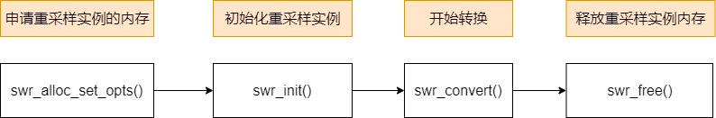

### swr_convert音频重采样

####  音频重采样库的API函数调用流程如下
 * swr_alloc_set_opts()
 * swr_init()
 * swr_convert()

-----
### api 解释
### 1: swr_alloc_set_opts()
```c++
struct SwrContext *swr_alloc_set_opts(struct SwrContext *s,
                                      int64_t out_ch_layout, enum AVSampleFormat out_sample_fmt, int out_sample_rate,
                                      int64_t  in_ch_layout, enum AVSampleFormat  in_sample_fmt, int  in_sample_rate,
                                      int log_offset, void *log_ctx);


```
### 参数解释如下：
* struct **SwrContext** *s，如果传 NULL，他内部会申请一块内存，非NULL可以复用之前的内存，不用申请。
* int64_t **out_ch_layout**，目标声道布局
* enum **AVSampleFormat** out_sample_fmt，目标采样格式
* int **out_sample_rate**，目标采样率
* int64_t **in_ch_layout**，原始声道布局
* enum **AVSampleFormat** in_sample_fmt，原始采样格式
* int **in_sample_rate**，原始采样率
* int log_offset，不知道做什么的，填 0 就行。
* void *log_ctx，不知道做什么的，填 NULL 就行。
### 2 swr_init()
* 初始化重采样函数，如果你更改了重采样上下文的 options，也就是改了选项，例如改了采样率，必须调 swr_init() 才能生效。。
### 3 swr_convert()，转换函数
```c++
 ** Convert audio.
*
* in and in_count can be set to 0 to flush the last few samples out at the
* end.
*
* If more input is provided than output space, then the input will be buffered.
* You can avoid this buffering by using swr_get_out_samples() to retrieve an
* upper bound on the required number of output samples for the given number of
* input samples. Conversion will run directly without copying whenever possible.
*
* @param s          allocated Swr context, with parameters set
* @param out        output buffers, only the first one need be set in case of packed audio
* @param out_count  amount of space available for output in samples per channel
* @param in         input buffers, only the first one need to be set in case of packed audio
* @param in_count   number of input samples available in one channel
*
* @return number of samples output per channel, negative value on error
*/
int swr_convert(struct SwrContext *s, uint8_t **out, int out_count,
const uint8_t **in , int in_count);

```
### 参数解释如下：
* struct SwrContext *s，重采样上下文，也叫重采样实例。
* uint8_t **out，       输出的内存地址。
* int out_count，       每声道有多少个样本，这个值通常建议设置得大一点，避免内存空间不够，不够空间写入，就会缓存在重采样实例里面，越积越多。
* const uint8_t **in，   输入的内存地址。
* int in_count，      输入的音频流，每声道有多少个样本。
### swr_convert() 函数的返回值是实际的样本数。


