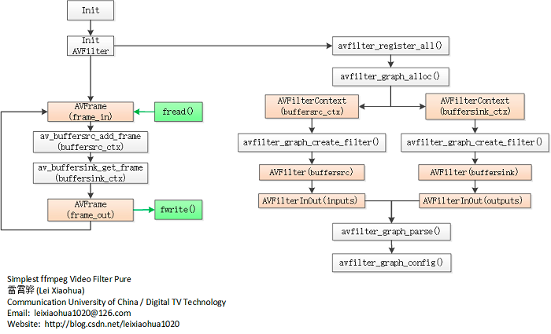

### ffmpeg 的format的滤镜 : 转换图像格式；
* 如yuv420p 转成yuv444p

### AIP 
* -1 : avfilter_graph_alloc()   : 为FilterGraph分配内存
* 0 : avfilter_graph_create_filter() : 创建并向FilterGraph中添加一个Filter
* 1 : AVBPrint ：av_bprintf() : 设置滤镜参数
* 2 : avfilter_graph_parse2() : 解析滤镜字符串
* 3 : avfilter_graph_config() : 检查AVFilterGraph的配置有效性，并配置其中的所有连接和格式。
* 4 : avfilter_graph_get_filter() :根据名称获取 滤镜容器内部的某个 滤镜上下文
* 5 : av_buffersrc_add_frame_flags() : 向输入缓冲区添加音视频帧，带有flag。其中flag包括不检测格式是否发生变化、立即推送帧到输出队列、保持音视频帧的引用
* 6 : av_buffersink_get_frame_flags() :从输出缓冲区取出滤波后的音视频 帧：内部调用get_frame_internal()函数

### 官方链接 [format](https://ffmpeg.org/ffmpeg-filters.html#format-1)
### 参考：https://github.com/0voice/audio_video_streaming/fork

