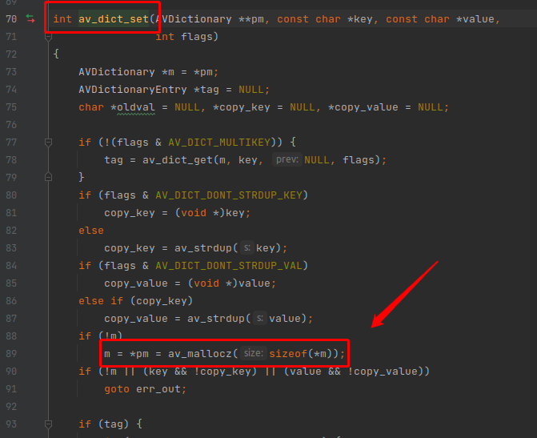
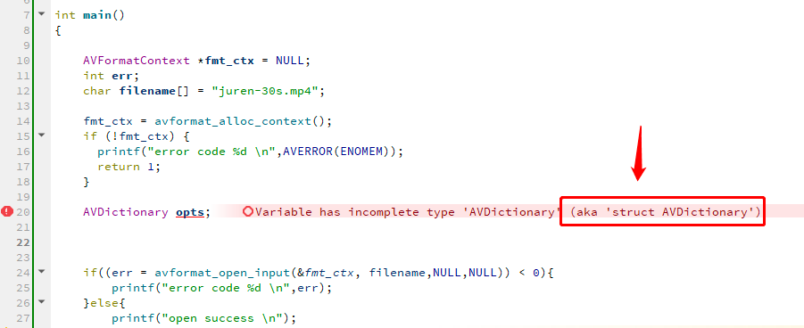

### 解复用器 （demuxer）
* 解复用器 （demuxer）的参数 分为 通用部分 跟 私有部分。
* 通用部分是指所有文件格式都有的属性，例如 formatprobesize 是 MP4 跟 FLV都有的属性。而 export_all 是只有 MP4 自己才有的属性。
* 通用部分的参数可以通过以下命令来查看：
> ffmpeg -h > t.txt

> ffmpeg -hide_banner 1 -h demuxer=mp4
```c++
Demuxer mov,mp4,m4a,3gp,3g2,mj2 [QuickTime / MOV]:
Common extensions: mov,mp4,m4a,3gp,3g2,mj2,psp,m4b,ism,ismv,isma,f4v.
mov,mp4,m4a,3gp,3g2,mj2 AVOptions:
-use_absolute_path <boolean>    .D.V....... allow using absolute path when opening alias, this is a possible security issue (default false)
-seek_streams_individually <boolean>    .D.V....... Seek each stream individually to the closest point (default true)
-ignore_editlist   <boolean>    .D.V....... Ignore the edit list atom. (default false)
-advanced_editlist <boolean>    .D.V....... Modify the AVIndex according to the editlists. Use this option to decode in the order specified by the edits. (default true)
-ignore_chapters   <boolean>    .D.V.......  (default false)
-use_mfra_for      <int>        .D.V....... use mfra for fragment timestamps (from -1 to 2) (default auto)
auto            -1           .D.V....... auto
dts             1            .D.V....... dts
pts             2            .D.V....... pts
-export_all        <boolean>    .D.V....... Export unrecognized metadata entries (default false)
-export_xmp        <boolean>    .D.V....... Export full XMP metadata (default false)
-activation_bytes  <binary>     .D......... Secret bytes for Audible AAX files
-audible_key       <binary>     .D......... AES-128 Key for Audible AAXC files
-audible_iv        <binary>     .D......... AES-128 IV for Audible AAXC files
-audible_fixed_key <binary>     .D......... Fixed key used for handling Audible AAX files
-decryption_key    <binary>     .D......... The media decryption key (hex)
-enable_drefs      <boolean>    .D.V....... Enable external track support. (default false)
```
* 无论是通用还是私有属性，都是使用 AVDictionary 来设置 demuxer 的属性的，就是最后一个参数 AVDictionary **options，如下：

> int avformat_open_input(AVFormatContext **ps, const char *url, ff_const59 AVInputFormat *fmt, AVDictionary **options);
* 读者可能会疑惑，设置复用器的属性，直接设置他的字段不就行了，为什么要搞一个 AVDictionary 出来。因为 FFmpeg 社区有大量的命令行用户，他们习惯通过 字符串传参 来 设置 复用器，解码器等等的属性。有些用户是不会写 C/C++ 代码的。

* AVDictionary 这个结构就是为了 命令行的字符串传参 这个需求而设计出来的，它的定义如下：
```c++
struct AVDictionary {
    int count;
    AVDictionaryEntry *elems;
};

```

```c++
typedef struct AVDictionaryEntry {
    char *key;
    char *value;
} AVDictionaryEntry
```
* 可以看到，非常简单，AVDictionary 就是一个列表，里面存储着多个 AVDictionaryEntry，而 AVDictionaryEntry 是一个 key value 的结构体。
### AVDictionary 的内存是从哪里来的呢？
* 是从 av_dict_set() 函数内部申请的内存，如果你传 NULL 给它，av_dict_set() 内部就会申请一块内存，可以看到函数的第一个参数是一个二级指针。

 

* 在用完 AVDictionary 之后，需要调 av_dict_free() 手动释放堆内存。
### 如何申请一个栈内存的 AVDictionary ，也就是局部变量
* 无法做到，AVDictionary 只能以指针指向堆内存的方式来使用，如果你想创建一个 局部变量 AVDictionary opts 放在栈内存里面，编译器会报 incomplete type 未实现类型错误。




