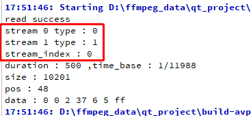

### [FFmpeg 读取文件内容AVPacket](https://github.com/lokenetwork/FFmpeg-Principle)

### 读取文件内容 相关的函数如下
* **av_packet_alloc**() ;初始化一个 AVPacket
* **av_read_frame**() :从 AVFormatContext 容器里面读取一个 AVPacket，需要注意，虽然函数名是 frame，但是读取的是 AVPacket。
* av_packet_unref() : 减少 AVPacket 对 编码数据的引用次数。减到 0 会释放 编码数据的内存。
* av_packet_free() : av_packet_unref

* AVPacket 里面有一个 stream_index 字段，代表这个 AVPacket 属于哪个流，那我们怎么知道这是一个音频包，还是视频包？在下面的字段里面：
> fmt_ctx->streams[0]->codecpar->codec_type
* AVPacket 里面还有一个 duration 字段
  * 代表这帧数据要播放 多久。
  * 时间基是 11988 ，时间基就是 1秒钟分成11988份，
  * 然后这个视频包占了 500 份，也就是当前帧要播放 0.04 秒
  * 。因此这个mp4 文件大概猜测，就是1秒钟播放24个视频包。

