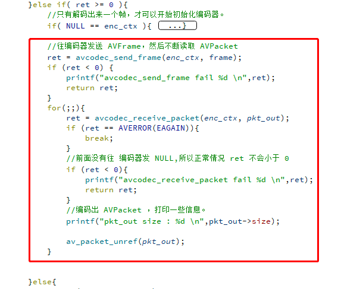
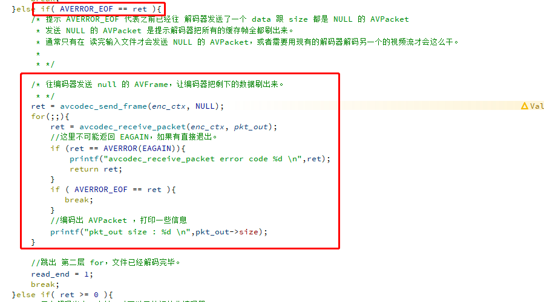

### 学习使用编码器

### 编码相关API
* avcodec_alloc_context3()
  * 通过传递 AVCodec 编解码信息来初始化上下文
* avcodec_open2()
  * 打开一个编码器 或者 解码器
* avcodec_send_frame()
  * 往 AVCodecContext 编码器 发送一个 AVFrame
* avcodec_receive_packet()
  * 从 AVCodecContext 编码器 读取一个 AVPacket
---
### 往 编码器 发数据
* 其实编码过程跟解码过程是类似，发了一个 AVFrame 后，需要循环不断读取 AVPacket 直到返回 EAGAIN 。

### 从编码器收数据

* 当读到末尾的时候，也需要往编码器发送一个NULL，告诉编码器没有更多的 AVFrame 输入了，这样编码器内部就知道已经没有更多的输入了，只要把剩下的 AVPacket 全部刷出去，刷完就会返回 AVERROR_EOF。
### [参考](https://ffmpeg.xianwaizhiyin.net/api-ffmpeg/encode.html)
