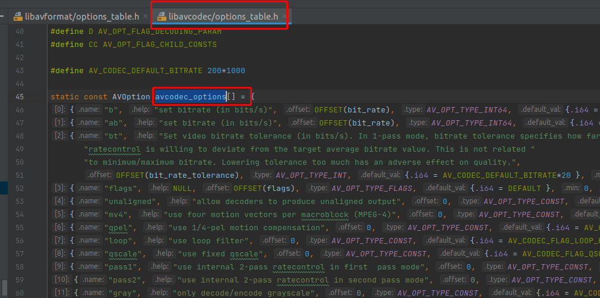

[如何设置编码器参数](https://ffmpeg.xianwaizhiyin.net/api-ffmpeg/encode_args.html)

* 编码器 （encode）的参数也是分为 **通用部分 跟 私有部分。**
    * 通用部分是指大部分编码器都有的属性，例如码率就是通用的。通用部分的参数是在 avcodec_options 变量里面的
      
* 通用部分查询命令
    * ffmpeg -h
* 编码器私有部分 查询命令
    * ffmpeg -h decoder=h264

### 重点来了

* 无论是通用还是私有属性，都是使用 AVDictionary 来设置的，就是最后一个参数 **AVDictionary** **options，如下：

```c++
int avcodec_open2(AVCodecContext *avctx, const AVCodec *codec, AVDictionary **options);

```

* 最后使用完之后，需要调 av_dict_free() 来 **释放 AVDictionary 的内存**

### 扩展

* 解码器参数的设置 跟编码器参数设置是类似，照葫芦画瓢就行。解码器的参数通常比较少。

### 指针 一定要初始化

```c++
AVDictionary *avDictionary = NULL;
```
