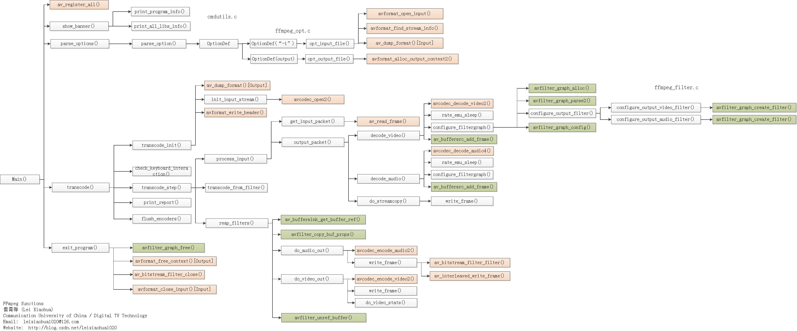

### 概览

### 有趣的函数
* void av_packet_move_ref(AVPacket *dst, AVPacket *src);
  * 将src的全部信息放到dst中，并且将 src中信息擦除
* av_fifo_space()
  * 判断 AVFifoBuffer 里面还有多少内存空间可以写？
* av_fifo_generic_write()
* av_usleep() 
  > 函数的单位是微妙，也就是百万分之一 秒

### 参数配置
* -an 不解码音频

### 读码参考
* [ffplay.c源码分析](https://www.cnblogs.com/juju-go/p/16489044.html)
* [AVFifoBuffer](https://ffmpeg.xianwaizhiyin.net/api-ffmpeg/avfifobuffer.html)
### 编译参考
* [ffplay Mac CLion Debug调试](https://cfm880.github.io/2019/04/27/audio_video/001_ffplay_clion/)

* [./configure && make && make install详解](https://www.cnblogs.com/dsc65749924/p/5852177.html) 